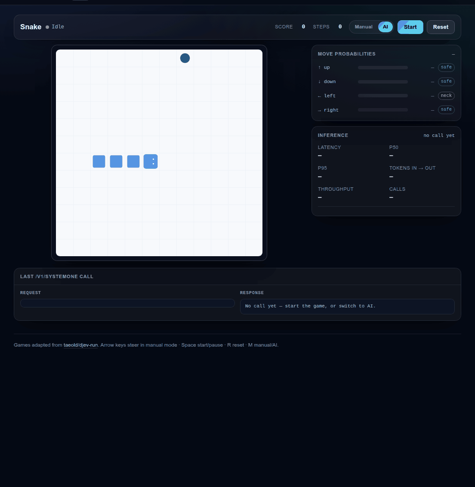
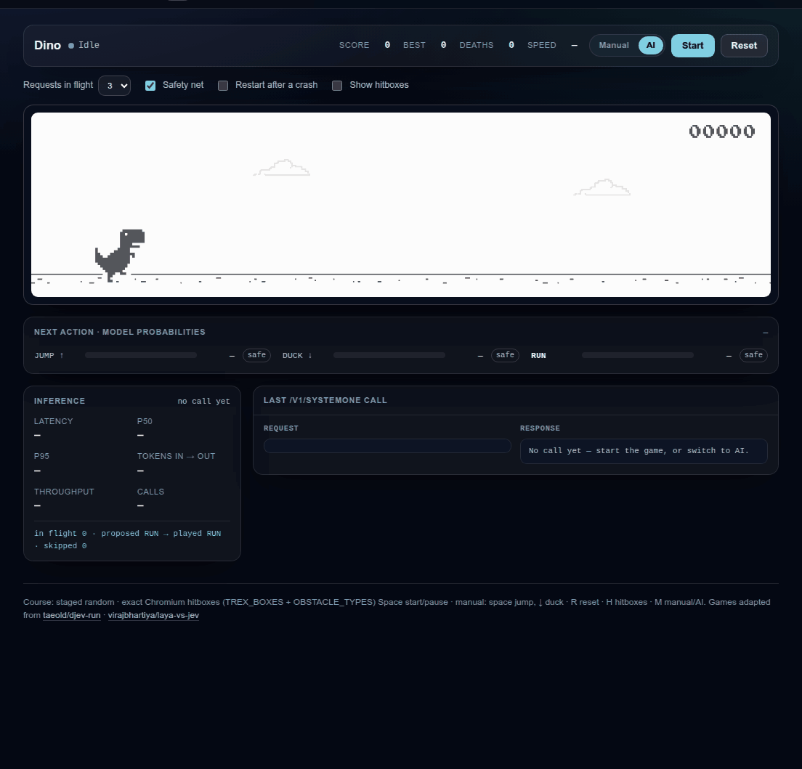
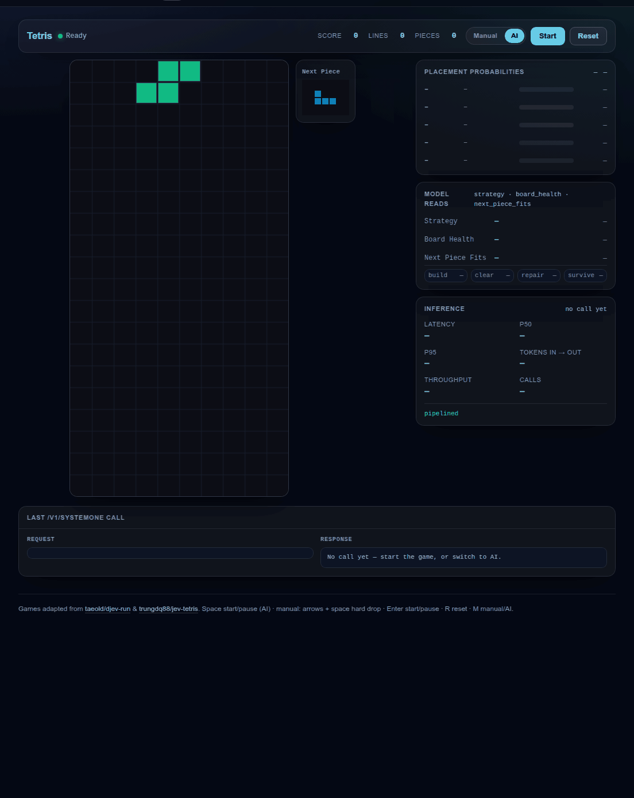

# Decis

[English](README.md) · **简体中文**

[](https://github.com/chaitin/Decis/actions/workflows/ci.yml)
[](LICENSE)
[](pyproject.toml)
[](https://hub.docker.com/r/chaitin/decis)

**一个 API，跑所有轻量决策模型。**

Decis 是一个可以自托管的推理服务端，专门跑开源决策模型。它实现的是
[TypeSafe 的 System One API](https://docs.typesafe.ai/api)——也就是官方 `typesafe-sdk` 本来就在说的
`/v1/systemone` 契约——所以把 SDK 指向你自己的地址就是全部迁移工作。一套线格式契约，多种可互换的
引擎，一个引擎一个容器。

*决策模型*不生成文本，而是针对有类型的问题返回校准过的概率：只做一次前向，小到可以和应用跑在
一起。

- **开箱即用。** 一句 `docker compose up`，你就有一个在回答 `/v1/systemone` 的引擎和一个可以上手的
   playground。权重烤在镜像里，启动时不需要下载，也没有任何卷要挂。
- **Jev 风格的 API。** 服务端说的是那个闭源模型同样的契约，官方 `typesafe-sdk` 只需要改 `base_url`。
- **Laya 与 kev，各自一个镜像。** 每个引擎一个多架构发布镜像，权重自带。
- **带三个游戏的 playground。** 贪吃蛇、恐龙、俄罗斯方块，每个决策都真的是一次 `/v1/systemone`
  调用。

> **状态：pre-1.0，当前 `v0.3.0`。** 线格式契约（`v1`）稳定，只增字段；运行中的服务在
> `/healthz` 报告自己的版本。

## 快速开始

三条命令，不用构建，也不下载模型：

```bash
git clone https://github.com/chaitin/Decis && cd Decis
cp .env.example .env                                # 设 DECIS_API_KEY
docker compose -f docker-compose.yml up -d --wait    # 引擎在 :8000，游戏在 :8080
```

`laya-multilingual` 是默认引擎。`/healthz` 立刻可用，`/readyz` 在模型能作答之前一直报 `loading`：

```bash
until curl -fsS localhost:8000/readyz >/dev/null; do sleep 2; done
```

客户端只需要改一行。官方 SDK 指向这里就能原样工作：

```python
from typesafe_sdk import Choice, Noul, TypeSafeClient

# 不传 model：SDK 会发它的默认值 "jev-latest"，Decis 用它实际加载的引擎作答。
# 迁移的全部工作量就是换掉 base_url。
client = TypeSafeClient(api_key="local", base_url="http://127.0.0.1:8000")

response = client.system_one(
    state={
        "subject": "Duplicate charge on invoice #4411",
        "body": "We were billed twice for March. Refund it today or we cancel our plan.",
    },
    questions={
        "department": Choice(
            instructions="Which team should handle this?",
            criteria={
                "billing": "invoices, payments, refunds",
                "technical": "bugs, outages, system errors",
                "sales": "pricing, new contracts",
            },
        ),
        "churn_risk": Noul(instructions="Does the user threaten to cancel or leave?"),
    },
)

print(response.choices["department"].choice)  # 你某个 criteria 的键
print(response.choices["department"].confidence)  # 0..1
print(response.nouls["churn_risk"].noul)  # P(true)，0..1
```

Compose 会拉两个发布镜像：`chaitin/decis:laya-multilingual` 与 `chaitin/decis:playground`。不用
Compose 的话，只起 API：

```bash
docker run --rm -p 8000:8000 -e DECIS_API_KEY=change-me chaitin/decis:laya-multilingual
```

想在源码目录里跑：

```bash
uv sync --extra dev --extra laya
uv run decis download --engine laya-multilingual   # 647 MiB，只需一次
uv run decis serve --host 127.0.0.1 --port 8000
```

就绪语义、裸 `curl` 写法，以及 `decis models` / `decis doctor`，见
[快速开始](docs/getting-started.zh-CN.md)。

## 引擎

出厂四个引擎。`laya-multilingual`（默认，约 100 种语言）与 `kev-0.8b` 有发布的多架构镜像；
`laya` 与 `laya-typed-decisions` 要在源码目录里跑。一个引擎一个镜像，引擎就是 tag，权重文件就在
镜像里——启动时不需要网络、不需要卷、也没有下载步骤。服务要求 Bearer token，比较用常数时间，并且
在公开地址上没配 token 时拒绝启动。

骨干、权重大小与每个引擎的上限见 [引擎](docs/engines.zh-CN.md)；镜像体积、不带权重的 runtime
变体、Kubernetes 探针与在代理后面构建，见 [部署](docs/deployment.zh-CN.md)。

## Playground

快速开始同时会在 <http://localhost:8080> 起三个网页小游戏——贪吃蛇、恐龙、俄罗斯方块，另外还有
一个专门讲 API 的 `/api` 页面。每个游戏都可以用键盘自己玩，也可以交给模型：手动/AI 开关、推理面板
和"最近一次调用"的控制台在三个页面上是同一套，AI 档下每个决策都真的发一次 `/v1/systemone`。API
key 留在 playground 服务端，页面永远拿不到；引擎也由它自己找到。见
[Playground](docs/playground.zh-CN.md)，包括游戏改编自哪些项目。

下面三段录屏是这三个页面在 AI 档下的样子，对着真实的 CPU 引擎录制；画面没有变化的帧被丢掉了。

| 贪吃蛇 | 恐龙 | 俄罗斯方块 |
|---|---|---|
|  |  |  |

## 文档

| 文档 | 内容 |
|---|---|
| [快速开始](docs/getting-started.zh-CN.md) | 从 clone 到第一个答案、就绪语义、CLI |
| [API 参考](docs/api.zh-CN.md) | 端点、Schema、原语、错误码、容量上限 |
| [API Schema](docs/schema/) | 生成的 JSON Schema 与服务端 OpenAPI 文档 |
| [配置](docs/configuration.zh-CN.md) | 全部 `DECIS_*` 变量、认证、权重路径、精度 |
| [引擎](docs/engines.zh-CN.md) | 每个引擎是什么、它的上限、如何新增 |
| [部署](docs/deployment.zh-CN.md) | Docker、Compose、`make`、Kubernetes |
| [性能](docs/performance.zh-CN.md) | 实测延迟与内存，以及它们是在哪台机器上测的 |
| [Playground](docs/playground.zh-CN.md) | 三个游戏、代理架构与致谢 |
| [线格式契约](docs/api-compatibility.md) | 精确的 jev 契约，每条结论带证据等级 |
| [设计](docs/design.md) | 架构、引擎抽象、打包 |
| [设计审查](docs/design-review.md) | 自我审查：已修缺陷、方法论局限、尚未验证的部分 |
| [可行性](docs/feasibility.md) | 调查结果与风险登记 |
| [`examples/`](examples/README.md) | 可运行的 `curl` 与官方 SDK 示例，CI 逐条执行 |
| [AGENTS.md](AGENTS.md) | 面向贡献者与 agent 的工程契约 |

线格式契约、设计、设计审查与可行性研究用中文写成；契约同时钉在生成的 JSON Schema 里：
[`docs/schema/`](docs/schema/) 由 `src/decis/schema.py` 生成并进 CI。

## 与其他项目的关系

- **[Jev](https://docs.typesafe.ai/introduction)**（TypeSafe AI）——本项目对标的闭源模型。
  Decis 复刻的是它的*接口*，不是模型。
- **[kev](https://github.com/jaredpalmer/kev)**（Jared Palmer）——基于 Qwen3.5 的 Jev 风格决策
  模型。Decis 复用了 kev 的推理内核（vendor 固定版本，Apache-2.0，署名见 [`NOTICE`](NOTICE)），
  并把服务层推广到多个引擎。
- **[Laya](https://huggingface.co/convaiinnovations/laya)**（Convai Innovations）——Apache-2.0，
  多语言，一次前向。Decis 把官方 `laya` 包作为引擎使用。
- **[djev-run](https://github.com/taeold/djev-run)**（Daniel Lee）——playground 的游戏改编自它；
  见 [Playground](docs/playground.zh-CN.md#致谢)。

## 参与贡献

欢迎贡献。[`CONTRIBUTING.md`](CONTRIBUTING.md) 写了开发环境、两套测试环境与 PR 规则；
[`AGENTS.md`](AGENTS.md) 是**规范性的工程契约**——唯一事实来源、不变量与禁用清单——对人和
自动化贡献者同样有效。

```bash
uv sync --extra dev
uv run pytest -q            # 无权重的那套：CI 跑这个
uv run ruff check && uv run ruff format --check
```

安全问题请走 [`SECURITY.md`](SECURITY.md)，不要开公开 issue。

## 许可证

Apache-2.0。第三方署名见 [`NOTICE`](NOTICE)。
